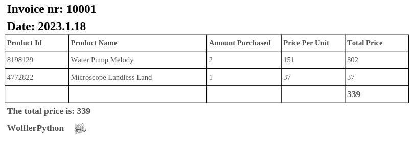

# Invoice to PDF Converter
<p align="center">
  
</p>

This Python script converts invoice data from Excel files into PDF format. It uses the `glob`, `pandas`, `fpdf`, and `pathlib` libraries.

## How it works

1. The script finds all Excel files in the "invoices" directory.
2. For each file, it creates a new PDF document.
3. The script extracts the invoice number and date from the filename and adds these details to the PDF.
4. It reads the Excel file into a pandas DataFrame and extracts the column names. These column names are added to the PDF as the header of a table.
5. The script iterates over each row in the DataFrame. For each row, it adds the product ID, product name, amount purchased, price per unit, and total price to the PDF as cells in the table.
6. Finally, the script saves the PDF to the "PDFs" directory. The filename of the PDF is the same as the original Excel file.

## Requirements

- Python 3.6 or higher
- pandas
- fpdf
- glob
- pathlib

You can install the required libraries for this script using pip, which is a package manager for Python. Open your terminal and type the following commands:

```bash
pip install pandas
pip install fpdf
pip install glob2
```

Please note that `pathlib` is a standard library in Python 3, so you don't need to install it separately. Also, `glob` is a part of Python's standard library, but `glob2` is an enhanced version that you can install separately.

## Usage

1. Place your Excel files in the "invoices" directory.
2. Run the script with `python main.py`.
3. The converted PDFs will be saved in the "PDFs" directory.

## License

This project is licensed under the terms of the MIT license.

## 